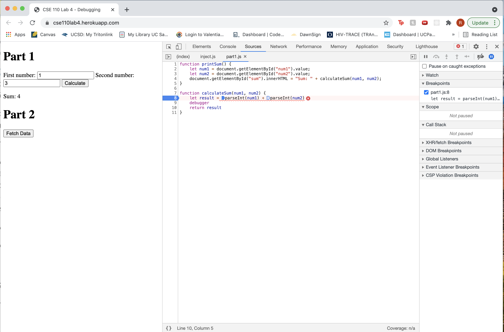

## Part 3
1. The bug was that the 'calculate' button was not actually adding two integers together, but instead, concatenating two strings.
2. I would fix it by converting the strings 'num1' and 'num2' to integer values using parseInt() as shown in the picture:
   

3. citylots.json
4. part2.js
5. 11.7 MB
6. 72 ms
7. Mozilla/5.0 (Macintosh; Intel Mac OS X 10_14_6) AppleWebKit/537.36 (KHTML, like Gecko) Chrome/89.0.4389.128 Safari/537.36
8. Apache
9. Tue, 26 Jan 2021 22:14:13 GMT
10. application/json
11. fetchData()